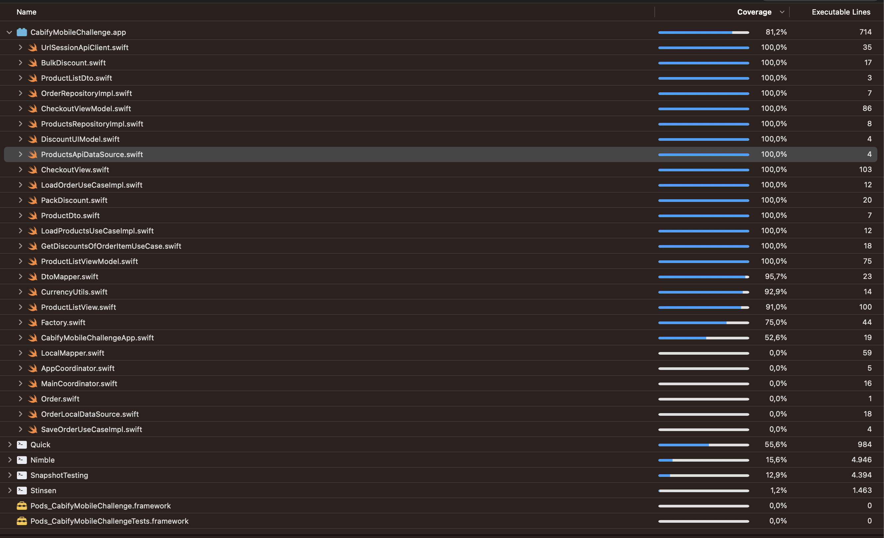

# Cabify Mobile Challenge
[](https://app.bitrise.io/app/2090efaaa9c5b60f)
[](https://codecov.io/gh/yeniel/CabifyMobileChallenge)
[](https://swift.org)
[](https://apple.com)

This is my implementation of a the Cabify Mobile Challenge. The specification readme is [here](https://github.com/cabify/MobileChallenge).


## Table of contents
1. [Installation](#installation)
2. [Pods and Packages](#pods-and-packages)
3. [Architecture and Design Patterns](#architecture-and-design-patterns)
4. [Unit Tests](#unit-tests)
5. [CI](#ci)
6. [Known Issues](#known-issues)


## Installation
1. Download the project:
```
git clone https://github.com/yeniel/CabifyMobileChallenge
```
2. Wait until all Swift Package Manager are fetched

## Pods and Packages
1. CocoaPods
	- [SwiftLint](https://github.com/realm/SwiftLint): Linter I have used to static code analysis. 
2. Swift Package Manager
	- [Factory](https://github.com/hmlongco/Factory): Dependency injector, based on container-based dependency injection pattern
	- [Stinsen](https://github.com/rundfunk47/stinsen): Router based on coordinator pattern
	- [Quick](https://github.com/Quick/Quick): Unit tests
	- [Nimble](https://github.com/Quick/Nimble): Unit test assertions
	- [SnapshotTesting](https://github.com/pointfreeco/swift-snapshot-testing): Snapshot tests for views
	- [OHHTTPStubs](https://github.com/AliSoftware/OHHTTPStubs): Stub network requests to test data layer.

## Architecture and Design Patterns
First of all, I want to say that when I thought this app it was as a big project. Therefore this project, in the future, could have more features, and all the current ones could be more complex.
In some parts the design patterns seem like an overkill or maybe add needless complexity, but I chose them to show my knowledge.

I tried to follow the bases of a **Clean Architecture** and the **SOLID** principles. The intention is to have a testable, robust and scalable code and avoid the following bad smells:
- God entities
- Repeated code
- Non testable code
- Coupled code
- Lower cohesion

### Data Layer
#### Repositories
I implemented the **repository pattern** for products and order requests. The repository pattern is good to manage collection of items.

For products, I only implemented one data source which is the api data source. But this design pattern let the code prepared to implement a cache system. The concrete implementation of this local data source could be based on `CoreData` or *Realm*.
The cache logic have to be added in the repository class and this logic will decide how and when  each data source is used. 
The expiry of the cache could be received from the backend and also will managed in the repository class.
In my opinion a memory data source is not needed. It can be managed directly in the repository.

In the order repository I added a local data source as an example of persistence data source. I used `UserDefaults` as the concrete implementation but should be `CoreData` for more complex data.

The concrete implementation of the api client is based in `URLSession`.

#### Dtos
I used data transfer object to parse the json of the api responses using the `Codable` protocol

#### Dto Mapper
A mapper to map the dtos to domain models

### Domain Layer
#### Models
Core models of the business.

#### Discount Strategy
To modelize the discounts I chose the *Strategy* pattern. I identify two kind of discounts from the current specifications, pack and bulk discount.
These discounts models are generics. If we want to and a new discount, for example 3x2 for Mugs, we have just to add a new `PackDiscount` to the list of discounts.
An improvement, could be get the parameters to configure the discounts from backend. We could implement a discount repository to get the list of discounts

#### Pack Discount
The pack discount has the pack quantity and the paid quantity, in a 2x1 pack discount the pack quantity is 2 and the paid quantity is 1.

#### Bulk Discount
The bulk discount has a minimum quantity and the discount percentage, in the current specifications the min quantity is 3 and the percentage is 5%

#### Errors
The model `CabifyError` is used through all the app to map the errors to a business error.

#### Use Cases
I used use cases to add the business logic, for example, the use case to get the discounts of an order item. Also, use cases helps me to **deacoplate** the layers. The comunication between the presentation layer and data layer is made throught the use cases (I don't have any repository in viewmodels)

### Presentation
I implemented the **MVVM pattern**. The views are in **SwiftUI** and I used **Combine** through all the app for asynch process.

#### ViewModels
The view models contain the presentation logic

#### Routing
I used the *Stinsen* package to deacoplate the navigation logic from the views using the coordinator pattern. This approach helps me to test better in case I have to add more complexity to the navigation in the future.

#### UI Models and Mapper
I mapped domain models to ui models. The intention is to give the views a more specific models and avoid adding logic to it (eg. currency format). Also give the view only the data that it needs.

## Unit Tests

I used *Quick* for all tests and *Nimble* for the assertions. The `ObjectMother` provides me mocked models. I try to follow as much as I can **FIRST** principles

To increase the speed I change a little the entry point of the app (`CabifyMobileChallengeApp.swift`).
I cut the app to a simple view in case we are running the tests.

### Scheme Configuration

I configured the scheme to randomize the execution order.

I set the App Language to English and the Region to Spain.

### Coverage

The **coverage** is **81,2%**



#### Data
- Repositories: Test map dto to domain model.
- UrlSessionApiClient: Test json parse to Codable Dtos. I used OHHTTPStubs to stub request using mocked jsons.

#### Domain
- Test business logic.

#### Presentation
- ViewModels: Test presentation logic.
- Views: Snapshots to test all the design. The snapshot images are in [Snapsgots](CabifyMobileChallengeTests/Presentation/Snapshots/__Snapshots__/)

## CI
I chose **Bitrise** as CI. I created a workflow with a trigger on every push on main branch. You can see the badge of the status in the top of this README, and if you click on it you will see the Bitrise builds. There also a badge of code coverage.

I added the following steps:
1. Build
2. Run tests
3. Send coverage to [Codecov](https://about.codecov.io/)

## Known Issues
In the console appears the message:

 *NavigationLink presenting a value must appear inside a NavigationContent-based NavigationView. Link will be disabled.*.

Tracking issue [here](https://github.com/rundfunk47/stinsen/issues/29#issuecomment-1194301980)


